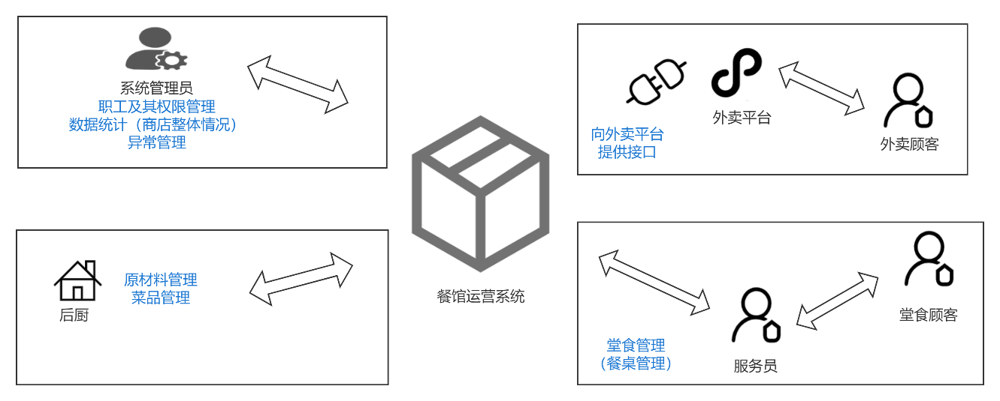
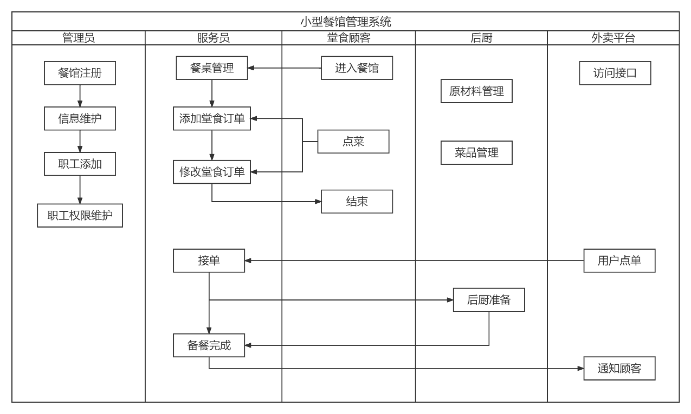
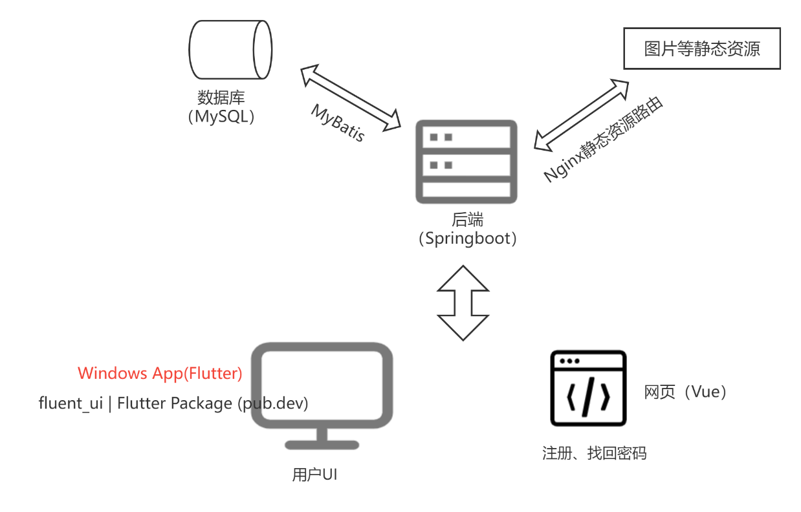
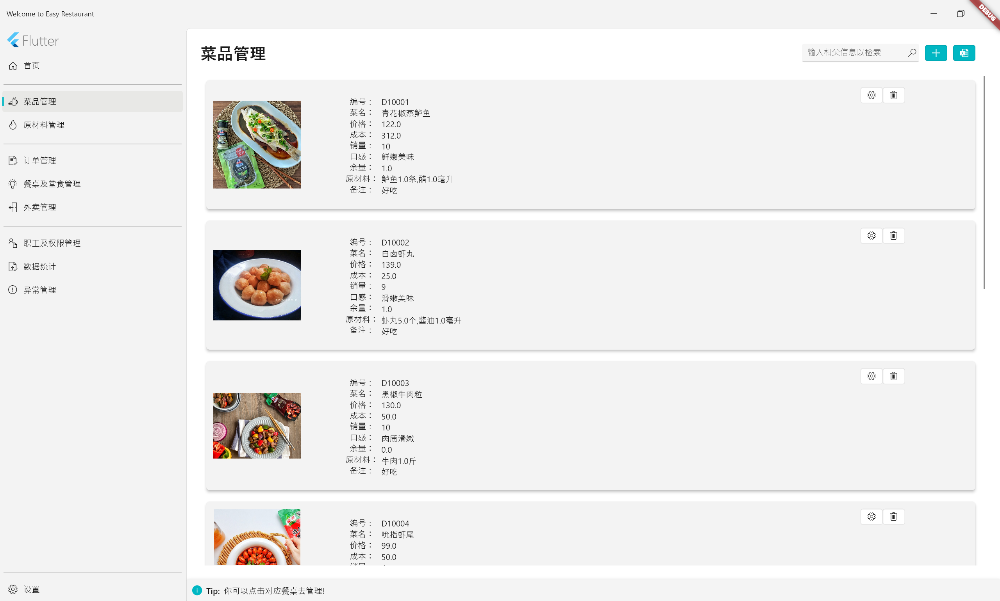
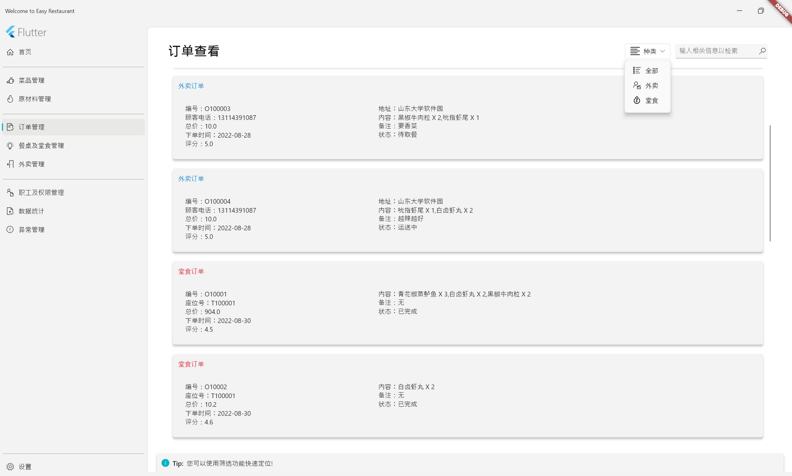
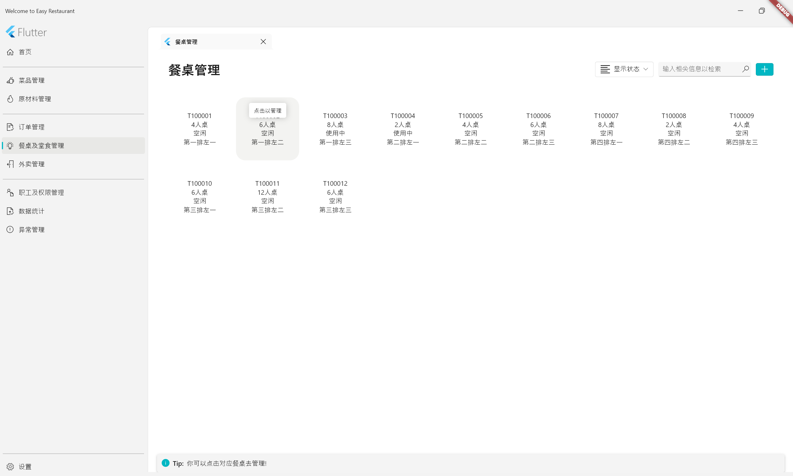
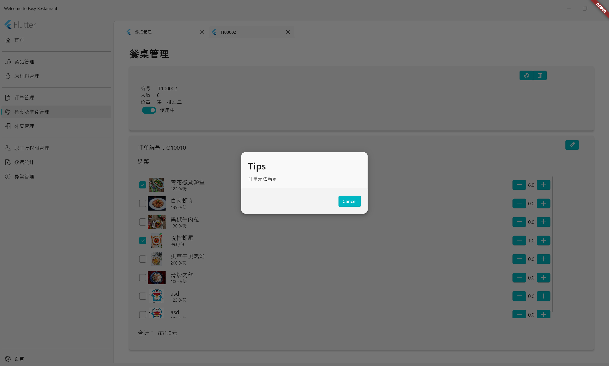

## 1. 系统概述

在计算机深刻改变人类生活之前，餐饮行业的运作是极度依赖“掌柜”的账簿的，因此需要心思细致的人完成。而在如今，随着数字化与信息化的不断深入，不仅是餐饮行业，许多大企业的管理也极度依赖于ERP（Enterprise Resources Planning）类工业软件。这类软件统筹企业运作过程的各个环节，往往需要争对不同的场合进行个性化定制，因此具有很强的市场潜力。而对于餐饮行业而言，需求相对固定，于是本系统便可以给出一种相对通用的解决方案。如下图所示，本系统为四类用户提供服务。

-  面向**系统管理员（店长）**，提供职工及其权限管理，数据统计管理，展示商店整体的经营状况，系统的异常管理；
- 面向**后厨（采购）**，提供原材料、菜品管理；
- 面向**外卖平台**，对其提供访问数据库的接口，用获取菜品等信息，同样的外卖平台也应该面向餐馆运营系统提供访问接口，以获取订单等信息；
- 面向**服务员**，提供餐桌管理、堂食订单管理。

## 2. 系统架构

本系统采用前后端分离架构，前端是采用flutter框架的windows桌面应用，并且使用flutter_ui这个面向Windows App的UI组件库来进行美化。以及为了方便用户操作，而使用Vue的注册页面、找回密码Web页面。后端则采用Springboot框架，并使用Nginx Web服务器配置静态路由来解决图片等静态资源的发放问题，采用Mysql数据库，并使用MyBatis框架管理SQL语句，操作数据库。

## 3. 系统展示

